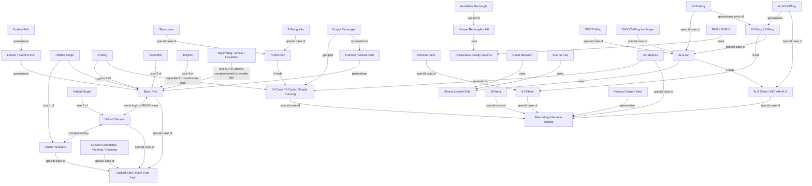

# Sudoku Solving Techniques: Families, Relationships and Naming History (Implementation Brief for sudokui.app)

Yes, your two observations are right: Swordfish and Jellyfish are the same logic as X-Wing with more rows and columns, and XY-, XYZ- and WXYZ-Wings are all special cases of the Almost Locked Set XZ rule (ALS-XZ). More generally, most of the dozens of named techniques reduce to three engines (subsets/fish, almost locked sets, and alternating inference chains), and the names are mostly 2005-era forum accidents that stuck because they were memorable and widely adopted before anyone unified the theory.

## TL;DR

- **Three engines, many names.** Subsets and fish are one idea (N sets locked into N other sets), seen from different "views" of the Sudoku cube. Wings are small Almost Locked Set (ALS) or chain patterns. Almost everything else, including X-Wing, Skyscraper, XY-Wing and W-Wing, can be written as an Alternating Inference Chain or loop. Uniqueness techniques (Unique Rectangles, BUG) are a separate branch that only works if the puzzle has exactly one solution.
- **X-Wing kept its name by precedence.** The size-2 fish was known and named first; by June 2005 forum regulars already called X-Wing and Swordfish "one of the few technique names that most people agree on," and nobody could say who coined them. The fish theme (Swordfish, Jellyfish, Squirmbag, Whale, Leviathan) grew afterwards, and "2-Fish" exists only as a systematic alias. The popular Star Wars explanation, repeated by The Times in a 2007 feature, is plausible but undocumented.
- **For the page, show both views.** Lead with a family map (Mermaid graph plus the JSON block below) and offer a difficulty ladder based on Sudoku Explainer ratings (X-Wing 3.2, Swordfish 3.8, XY-Wing 4.2, Jellyfish 5.2), noting that ladder order and family order disagree in instructive ways.

## Key Findings

1. **Fish = subsets in a transposed space.** Sudopedia states that "Fish and Subsets are complementary to each other. One can transform a problem of finding a fish into a problem of finding a subset, and vice versa," and that "a fish of any size appears as a naked subset in the rn- or cn- representations."\[1\]\[2\] Bob Hanson's St. Olaf Sudoku Assistant puts it bluntly: "An X-wing is really a naked pair; a swordfish is a naked triple, etc."\[3\] Sudopedia also lists "1-Fish" as a Hidden Single and "2-Fish" as an X-Wing.\[4\]
2. **Wings are ALS-XZ special cases.** Sudopedia's WXYZ-Wing page says it "can be replicated as an ALS-XZ move by considering the XZ cell as an ALS and the other three cells as the other ALS."\[5\] SudokuWiki's ALS page says XYZ-Wings and WXYZ-Wings "are subsets of ALS," and that "ALS XZs are just a two step chain."\[6\]
3. **Chains are the umbrella.** HoDoKu describes an XY-Wing as "really a short XY-Chain," a W-Wing as "really a chain as well,"\[7\] a Turbot Fish as "really a chain and not a fish," and a Skyscraper as "a special form of Turbot Fish" that "can be seen as two Sashimi X-Wings."\[7\]\[8\]
4. **Set logic unifies all of it.** Allan Barker's framework treats every technique as truths (base sets) covered by links (cover sets). Rank 0 (N truths, N links) is the fish rule; rank 1 "include[s] chains, finned fish, XY-wings, discontinuous nice loops, and Kraken fish."\[9\]\[10\]
5. **Names are historical accidents.** Skyscraper and 2-String Kite were named by forum user Havard on December 26, 2005 even though he acknowledged they were Turbot Fish; regulars objected at the time, and the names won anyway because they were easier to learn.\[11\]\[12\]

## Details: Family by Family

Each entry gives plain-language website copy, relationships, aliases, naming origin (with confidence) and difficulty position. Sudoku Explainer (SE) ratings are quoted from the SE rating table reproduced on the New Sudoku Players' Forum.\[13\]

### 1. Singles

**What it is (copy):** A naked single is a cell with only one candidate left. A hidden single is a digit that can go in only one cell of a row, column or box.

- **Relationships:** A hidden single is the size-1 case of both hidden subsets and fish (Sudopedia: "A 1-Fish is a Hidden Single").\[4\] A naked single is the size-1 naked subset.
- **Aliases:** Naked single = "sole candidate," "last value" (SE lists "Last value in block, row or column" separately). Hidden single = "unique candidate."\[13\]\[14\]
- **Naming:** Descriptive, no single coiner known. Confidence: descriptive/undocumented.
- **Difficulty:** SE 1.0 (last value), 1.2 (hidden single in box), 1.5 (hidden single in line), 2.3 (naked single).\[13\] SE's own FAQ notes that "many solvers are rating Naked Singles easier than Hidden Singles (which is reasonable when candidates are always visible)."\[13\]

### 2. Intersections (Locked Candidates)

**What it is (copy):** When a digit's candidates inside a box all lie on one row or column, that digit can be removed from the rest of that line (pointing). When a digit's candidates in a row or column all lie in one box, it can be removed from the rest of that box (claiming).

- **Relationships:** Both are "Locked Candidates." In set-logic terms they are the smallest possible fish-like interaction: one house covered by one other house. Sudopedia notes that X-Wings whose lines sit in one chute "disperse with a few Locked Candidates moves," which is why degenerate fish are not counted.\[15\]
- **Aliases:** Pointing pair/triple = Locked Candidates Type 1. Claiming = Box-Line Reduction = Locked Candidates Type 2. These are pure aliases; pick one primary label and list the rest.
- **Difficulty:** SE 1.7 (direct pointing), 1.9 (direct claiming), 2.6 (pointing), 2.8 (claiming).\[13\]

### 3. Subsets (Naked and Hidden Pairs, Triples, Quads)

**What it is (copy):** If N cells in a house can only hold the same N digits, those digits are "locked" into those cells (naked subset). If N digits can only go in the same N cells of a house, those cells must hold those digits (hidden subset).\[16\]

- **Complementarity:** Sudopedia: "Naked and hidden subsets are complementary. When a house with 7 unsolved cells has a naked subset of size 3, it also contains a complementary hidden subset of size 4."\[16\] This is why you never need subsets larger than 4 in a 9x9 grid: a naked quint always has a hidden subset of size 4 or less on the other side.
- **Aliases:** Sudopedia lists "disjoint subset, locked set and number chain" as alternative terms.\[16\]
- **Relationship to fish:** Same logic, different axis (see Fish).\[17\]
- **Difficulty:** SE 3.0 naked pair, 3.4 hidden pair, 3.6 naked triple, 4.0 hidden triple, 5.0 naked quad, 5.4 hidden quad. Note that hidden subsets rate above naked subsets of the same size in SE.\[13\]

### 4. Fish (X-Wing, Swordfish, Jellyfish and Variants)

**What it is (copy):** Pick one digit. If in N rows that digit can only appear in the same N columns, then those N rows will use up that digit in those N columns, so it can be removed from everywhere else in those columns.\[18\] N=2 is an X-Wing, N=3 a Swordfish, N=4 a Jellyfish.\[4\] Rows and columns can be swapped.

- **Sizes and names (HoDoKu):** "Size 2: X-Wing (X-Wing is a fish and not a wing!)," Size 3 Swordfish, Size 4 Jellyfish, Size 5 Squirmbag, Size 6 Whale, Size 7 Leviathan.\[19\] Sudopedia's Fish page uses the systematic "N-Fish" alias (1-Fish through 5-Fish).\[4\]\[19\]
- **Why sizes above 4 are never needed:** Sudopedia (Squirmbag): "In a standard Sudoku, a Squirmbag is always complemented by a smaller fish, because there are only 9 rows and columns. Some players prefer to look for fish in the rows only. They may find a Squirmbag in the rows, where others find the complementary X-Wing, Swordfish or Jellyfish in the columns."\[20\] Whale and Leviathan are therefore names for completeness, not tools a human needs.
- **Not every cell must be filled:** SudokuWiki shows "2-2-2" Swordfish where each line has only two candidates;\[21\] HoDoKu notes each line needs two or more candidates as long as the union of cover lines is N.
- **The 3D insight (copy):** Imagine the puzzle as a 9x9x9 cube: row x column x digit. The usual grid is the row-column (RC) view. Turn the cube so you look at row-digit (RN) or column-digit (CN) planes, and an X-Wing becomes an ordinary pair, a Swordfish an ordinary triple. Sudopedia's "Fish and Subsets" page demonstrates finding a hidden pair "using the X-Wing technique" on transformed data, and notes the rn/cn views were built into the SudoCue program and come from "The Hidden Logic of Sudoku" (Denis Berthier's book).\[1\]
- **Variants:**
  - *Finned fish:* a basic fish with extra candidates (the fin) in one box; eliminations only where a cell sees both the fish target area and all fins (Sudopedia).\[4\]
  - *Sashimi fish:* a finned fish where the fin's box has no candidate for the underlying fish. HoDoKu notes the naming dispute is "still not settled" and simply calls all non-basic types "Finned."\[4\]\[19\]
  - *Franken fish:* boxes allowed in base or cover sets.\[4\] SudokuWiki: "There is no Franken X-Wing."\[4\]\[22\]
  - *Mutant fish:* any mix of rows, columns and boxes not fitting other categories (Sudopedia).\[4\]
  - *Kraken fish:* a fish whose fin is resolved with outside chain information. Sudopedia: "A fish pattern with indirect connections to a candidate which can be eliminated."\[23\]\[24\] tarek's Ultimate FISH Guide defines it as a fish "that requires life support (information from outside the pattern)."\[4\]\[25\]
  - Sudopedia records that the "big fish" discussion on the Players' Forum is where boxes were added, generalizing fish to "any single-digit pattern that compares 2 partially overlapping constraint sets of equal size."\[4\]
- **Chain view:** HoDoKu shows Empty Rectangle as a Finned Mutant X-Wing; Sudopedia notes a minimal Swordfish "can also be seen as a Fishy Cycle";\[8\]\[18\] Jeff (Players' Forum, Dec 2005) quoted Bob Hanson's view that an X-Wing "is just the shortest non-repetitive x-cycle of length 4."\[12\]
- **Difficulty:** SE 3.2 X-Wing, 3.8 Swordfish, 5.2 Jellyfish.\[13\]\[26\] Finned/sashimi/Franken/mutant are not in classic SE; SudokuWiki's Site Map lists Finned X-Wing and Finned Swordfish under "Diabolical Strategies," the tier after "Tough Strategies."

### 5. Single-Digit Patterns (Turbot Fish, Skyscraper, 2-String Kite, Empty Rectangle, Coloring, X-Chains)

**What it is (copy):** These all follow one digit around the grid using "strong links" (a house where the digit has exactly two spots, so one must be true). Chain two strong links with a weak link in between, and at least one end must be the digit, so any cell seeing both ends loses it.

- **Turbot Fish:** HoDoKu: "A Turbot Fish is an X-Chain that is exactly four candidates long… One of them resembles a fish, which gave the technique its name."\[8\] Sudopedia frames it as a 5-node loop of odd length.\[27\] Allan Barker: "2 truths + 3 covers," rank 1.\[28\]\[29\]
- **Skyscraper:** two parallel strong links sharing one end line.\[8\]\[30\] HoDoKu: "a special form of Turbot Fish and it can be seen as two Sashimi X-Wings."\[8\]
- **2-String Kite:** one row strong link and one column strong link joined in a box. HoDoKu: "a second special form of Turbot Fish."\[8\]\[31\]
- **Empty Rectangle:** a box where the digit is confined to one row and one column, used with a strong link. HoDoKu: "can always be seen as a Finned Mutant X-Wing or as a Grouped Nice Loop." With only two candidates in the box it degenerates into a Turbot Fish.\[8\]
- **Simple coloring / multi-coloring:** two-color the strong-link network of one digit; contradictions eliminate. Equivalent to X-Chains/X-Cycles; Bob Hanson's page calls X-cycle analysis "Simple coloring."\[32\]
- **X-Chain / X-Cycle:** the general single-digit AIC. Skyscraper, 2-String Kite and Turbot Fish are length-4 X-Chains; X-Wing is a length-4 continuous X-Cycle.
- **Difficulty:** SE 6.6 rates Turbot Fish alongside forcing X-chains, which is far higher than how humans experience it.\[13\] HoDoKu and SudokuWiki place Skyscraper and 2-String Kite much earlier (SudokuWiki's "tough" tier lists X-Wing, Chute Remote Pairs, Simple Colouring, W-Wing, Y-Wing, Rectangle Elimination, Swordfish, XYZ-Wing, BUG, Avoidable Rectangles).\[33\] This is the clearest example of family and ladder views disagreeing.

### 6. Wings and Bent Sets (XY-Wing, XYZ-Wing, WXYZ-Wing, W-Wing)

**What it is (copy):** A wing is a small group of cells, not all in one house, that together behave like a locked set. In an XY-Wing, a pivot cell {X,Y} sees two "pincers" {X,Z} and {Y,Z}. Whatever the pivot is, one pincer becomes Z, so Z can be removed from any cell seeing both pincers.\[7\]\[34\]

- **XY-Wing:** HoDoKu: "really a short XY-Chain." Equivalent 3-cell XY-chain: Z- pincer -Y- pivot -X- pincer -Z.\[7\]
  - *As ALS-XZ:* ALS A = pincer {X,Z} (1 cell, 2 digits). ALS B = pivot {X,Y} + pincer {Y,Z} (2 cells, 3 digits). Restricted common = X. Eliminate Z from cells seeing every Z in both sets.
- **XYZ-Wing:** pivot holds {X,Y,Z}.\[7\] HoDoKu: Z "can only be eliminated from cells that see not only the pincers, but the pivot as well."\[7\]
  - *As ALS-XZ:* A = pincer {X,Z}; B = pivot {X,Y,Z} + pincer {Y,Z} (2 cells, 3 digits). RCC = X. Z's in both sets include the pivot, which is why the target must see all three cells.
  - SudokuWiki also notes "XYZ-Wing is a total sub-set of APE" (Aligned Pair Exclusion).\[35\]
- **WXYZ-Wing (Sudopedia, also "XYZW-Wing"):** four cells, four digits. Sudopedia: "observe that there are two almost locked sets: (a) WXYZ, XZ and YZ; and (b) WZ. Then the ALS-XZ rule can be applied with W being the restricted common, so Z can be eliminated." Sudopedia adds: "one can further extend the technique to VWXYZ-Wing, UVWXYZ-Wing and so on."\[5\]\[36\] Forum user StrmCkr summarizes on SudokuWiki that the "xy, xyz, wxyz, vwxyz, uvwxyz…" series are all "found under ALS xz rules," named by size.\[37\]
  - *Answer to your question:* Confirmed. A WXYZ-Wing is an ALS-XZ where one ALS is a single bivalue cell and the other is a 3-cell, 4-digit ALS.\[5\] The only reason it has its own name is that it was described as a pattern before ALS theory was mainstream.
- **"Bent naked subsets":** Bob Hanson's Sudoku Assistant uses "bent naked subsets" for these.\[3\] The idea: an XYZ-Wing is a "bent triple" and WXYZ a "bent quad" (a SudokuWiki commenter's phrasing), i.e., a naked subset that would be locked except that its cells don't all share one house.\[35\]
- **W-Wing:** two identical bivalue cells {X,Y} joined by a strong link on Y. HoDoKu: "A W-Wing really is a chain as well," written as a discontinuous nice loop.\[7\] **It is not a bigger XYZ-Wing**; the "W" does not mean "one more letter." It is an AIC of the form (X=Y)–Y=Y–(Y=X).
- **Remote Pairs:** a chain of identical bivalue cells; a special case of XY-Chain where every cell has the same two digits.
- **Difficulty:** SE 4.2 XY-Wing, 4.4 XYZ-Wing.\[13\] WXYZ and W-Wing are not in classic SE. HoDoKu: "Expanded wings with even more candidates have been described, but they are hard to find and are not supported by HoDoKu."\[7\]\[38\]

### 7. Almost Locked Sets (ALS-XZ, ALS-XY-Wing, ALS Chains, Death Blossom, Sue de Coq)

**What it is (copy):** An Almost Locked Set is N cells in one house holding N+1 candidates; one more removal would make it a locked subset.\[6\] A single bivalue cell is the simplest ALS. Two ALSs that share a "restricted common" digit X (every X in one sees every X in the other) let you eliminate any other shared digit Z from cells that see all of Z in both sets.

- **ALS-XZ:** the two-ALS rule. SudokuWiki: "ALS XZs are just a two step chain and a 'ALS Chain' is just continuing this logic." With two restricted commons ("doubly linked"), more eliminations follow.\[6\]\[39\]
- **ALS-XY-Wing:** three ALSs in an XY-Wing shape; the XY-Wing with each cell upgraded to an ALS.\[40\]
- **ALS Chains / AIC with ALS:** SudokuWiki: "you can use ALSs in place of XY cells (XY cells are just a simple type of ALS)."\[6\]
- **Death Blossom:** a "stem" cell with N candidates, each pointing to its own ALS "petal." SudokuWiki says it is "based on extending Aligned Pair Exclusion," and that the name came because the stem points to petals and "is a great deal more flowery."\[41\]\[42\] **Attribution conflict:** SudokuWiki credits Mike Barker, "who formulated it first"; Sudopedia says "The technique was invented by Sander Huisman."\[41\]\[42\] Treat the coiner as disputed.
- **Sue de Coq:** cells at a box/line intersection with two extra candidates, paired with sets in the line and in the box. HoDoKu: "first introduced by a user with nickname 'Sue de Coq' under the somewhat cumbersome name of 'Two-Sector Disjoint Subsets.' Other users soon started to call the technique by the inventor's nickname."\[43\] Sudopedia adds that "a remark that this was a true Sue de Coq gave the technique its present name" and classes it as "a special case of Subset Counting."\[44\] A German reference page dates the original "Two-Sector Disjoint Subsets" post to October 25, 2005.\[45\] Note: a later forum index credits the original presentation to user "rubylips," so the exact handle-to-person mapping is not fully settled.\[46\]
- **Difficulty:** Not in classic SE; SudokuWiki's Site Map lists Almost Locked Sets, Death Blossom and Sue-de-Coq under "Diabolical Strategies," alongside Finned X-Wing and Finned Swordfish.

### 8. Chains (XY-Chain, AIC, Nice Loops, Grouped Chains, 3D Medusa, Forcing Chains)

**What it is (copy):** A chain alternates strong links ("if this is false, that is true") and weak links ("if this is true, that is false"). If a chain starts and ends on the same digit, at least one end must be true, so any cell seeing both ends loses that digit. If it closes into a loop, every weak link in the loop yields eliminations.

- **Strong vs weak links (HoDoKu):** a strong link is a house or cell with exactly two options; a weak link is any "can't both be true" relation.\[8\]
- **X-Chain:** one digit only. **XY-Chain:** bivalue cells only. **AIC:** any mix. **Nice Loop:** the loop notation (continuous/discontinuous). **Grouped chains:** nodes can be groups of cells in a box-line intersection.
- **AIC as umbrella:** XY-Wing = 3-cell XY-Chain; W-Wing = discontinuous nice loop; Skyscraper/2-String Kite/Turbot = 4-node X-Chains; X-Wing = continuous X-Cycle; Empty Rectangle = grouped nice loop; ALS-XZ = two-step ALS chain. Forum user vidarino summed it up in January 2006: "We still call it XY-wing, even though it's just a short Forcing Chain, right? And X-Wing and Turbot Fish are just X-Cycles."\[12\]
- **3D Medusa:** coloring across all digits. Bob Hanson names it himself on the Sudoku Assistant: "what I'm calling 3D Medusa analysis,"\[3\]\[47\] explaining he chose it "because looking at the 3D rendition" made him "think of Medusa and her killer hair."\[32\] Sudopedia alias: "Advanced Coloring."\[23\]\[48\]
- **Forcing chains/nets:** follow implications from one candidate or cell in all branches; the most powerful and least pattern-like. SE rates them 7.0 and up,\[26\] and nested/dynamic variants up to about 11.7.\[13\]

### 9. Uniqueness Techniques (Unique Rectangles, BUG, Avoidable Rectangles)

**What it is (copy):** These techniques assume the puzzle has exactly one solution. If a placement would create a pattern that could be swapped to make a second solution (a "deadly pattern"), that placement must be wrong.

- **Unique Rectangle (UR):** four cells in two rows, two columns and two boxes that would hold only the same two digits. Types 1 to 6 are named by where the extra candidates sit; SE rates UR Types 1-4 at 4.5 to 4.8 and unique loops up to 5.1.\[13\]
- **BUG (Bivalue Universal Grave) and BUG+1:** SudokuWiki: "any Sudoku where all remaining cells contain just two candidates is fatally flawed."\[49\] The principle thread was posted by Jeff on the Players' Forum on November 28, 2005, defining BUG, BUG-Lite and BUG+n; Nick70 contributed in the same thread.\[50\] SE rates BUG 5.6 to 6.1.\[13\]
- **Avoidable Rectangle:** a UR variant using solved (non-given) cells.
- **Flag on the page:** `uses_uniqueness: true`. If sudokui.app ever allows user-entered puzzles with multiple solutions, these techniques can produce wrong answers.\[51\]

### 10. Unifying Frameworks

- **Allan Barker's set logic (Xsudo):** "General logic starts with the basic idea of base sets that are truths, and cover sets that are links." Every grid has "324 native truths" (81 cells, plus each digit in each of 9 rows, columns and boxes). "Rank = number of cover links - number of bases." Rank 0 is the fish rule, extended to any mix of houses and cells. Rank 1 "include[s] chains, finned fish, XY-wings, discontinuous nice loops, and Kraken fish."\[9\]\[10\] (Do not confuse Allan Barker with Mike Barker, the forum user credited with naming Kraken Fish and Death Blossom.)
- **Fish theory (tarek's Ultimate FISH Guide, Players' Forum):** generalizes basic fish to base/cover sets of rows, columns and boxes, with fins, endo-fins and cannibalism.\[25\]\[52\]
- **Space/cube view (Berthier, SudoCue, Sudopedia):** RC, RN, CN and box-number views make subsets and fish the same pattern.\[1\]
- **Practical takeaway:** For the page, present three "engines": (1) Locked sets (subsets, fish, intersections are rank 0 set logic), (2) Almost locked sets, (3) Chains. Uniqueness is a side branch.

## Why Is It Called an X-Wing? Why Do Old Names Survive?

**The documented facts:**
- By June 23, 2005, Players' Forum user scrose wrote: "Personally, I like the names x-wing and swordfish; they are one of the few technique names that most people agree on. When I encounter an x-wing, I 'see' an x-wing: two diagonal possibilities." In the same post he asked "Who came up with them and when?" and no one answered.\[53\] So the coiner was already unknown to the community in mid-2005.
- The same thread shows the strategy sites of Simes and Angus Johnson (Simple Sudoku) were already using X-Wing and Swordfish, and that simes cited an early Sudoku Programmers forum thread (setbb.com, t=9) for the N=2,3,4,5 naming: "2 for X-wing, 3 for the Swordfish, 4 for a Jellyfish, 5 for a Squirmbag." Another user immediately asked "what are jellyfishes and squirmbags?", suggesting those were newer.\[53\]
- Sudopedia: "Not all sizes of fish were discovered at the same time. Size 2 was already familiar to many players before they realized that the same trick could also be performed with more than 2 rows and columns." It also notes "The term Swordfish has also been in use for all types of fish with more than 2 rows or columns."\[4\]
- Names were not fixed early on: in September 2005, Programmers forum user Lummox JR said he preferred "to call all the 3+ methods swordfish," and another user said he had found X-Wing on his own and "called it rectangle."\[17\]\[54\]
- Squirmbag was unpopular. Late-2005 posters called it "yuck!" and suggested "Starfish"; one opined it "was coined in jest and unfortunately stuck." tarek's Ultimate FISH Guide lists "Starfish (a.k.a 5-Fish, Squirmbag)."\[25\]\[55\]

**The folklore (label it as such):**
- "X" for the diagonal shape of the four corners is the explanation most consistent with early forum usage (scrose's "two diagonal possibilities").\[53\] Confidence: likely.
- The Star Wars link appears in a February 2007 Times Online advanced-techniques feature (reproduced on sudokusolver.com): "There is a relationship between the diagonally opposite squares, hence the 'x' in x-wing. The term x-wing itself derives from the x-wing fighters in Star Wars." The Times cites no source, and no primary source from the coiner has been found. Confidence: folklore.
- The Fairey Swordfish story comes from the same Times/sudokusolver.com page: "The swordfish technique is named after a World War II biplane called the 'Fairey Swordfish'… This resembles the wings of a biplane, separated by struts." TheSudoku.com repeated it in a January 2026 blog post. Neither gives a primary source. Confidence: folklore.
- Whale and Leviathan (sizes 6 and 7) are listed by HoDoKu;\[19\] no coinage record was found.\[19\] They follow the "bigger sea creature" joke.

**Why X-Wing was never renamed:**
1. *Precedence:* the 2x2 pattern was named before anyone generalized it, so the general family was named around it rather than the reverse.\[4\]
2. *Memorability:* scrose's comment captures why the names stuck: people "see" the X and the spearing swordfish.\[53\]
3. *Consensus is rare:* in a field with many competing names, X-Wing and Swordfish were the rare ones with agreement, so nobody wanted to disturb them.\[53\]
4. *The systematic alias exists but stays niche:* "2-Fish" and "N-Fish" appear on Sudopedia;\[4\] a 2005 poster even joked about calling the general case a "gronk," with "gronk-2" for X-Wing.\[4\]\[53\]
5. *The result is the famous inconsistency:* HoDoKu has to warn readers that "X-Wing is a fish and not a wing!"\[19\]

**The wing naming mess:**
- XY-Wing: Angus Johnson (angusj) believed it "was first described" on the Programmers forum (setbb t=63) by Mat Newman; forum user ronk noted that in that thread gaby (Gaby Vanhegan) wrote "XY-wing (which I refer to as Y-wing, for simplicity…)". So "Y-Wing" began as a shorthand.\[56\] Confidence: documented (secondhand forum citation).
- Explanations for "Y-Wing" conflict: SudokuWiki says "it looks like an X-Wing, but with three corners, not four"; BrainBashers says the name "comes from the pattern formed by the digits and is not related to X-Wing."\[57\]\[58\] Both are post-hoc rationalizations.
- XYZ-Wing: Jeff wrote that he "first heard of this technique from Clive" and that "the name xyz-wing is proposed." So letters count the digits involved (XY = two pincer digits, XYZ = three in the pivot, WXYZ = four).\[59\]\[60\]
- W-Wing breaks the pattern: it has nothing to do with "one more letter," it is a two-bivalue-cell chain.\[7\] The page should say this explicitly.

**Why newer names keep appearing:**
- When Havard posted Skyscraper and 2-String Kite on December 26, 2005, he admitted "both of them can be classified under what is known as the 'Turbot Fish'." Jeff asked "why new names are given to an existing technique which has so many different names already?" and listed ten names for the same family: "turbot fish, fishy-cycle, multi-colouring, x-cycle, double chain, combination nice loop, advanced colouring, 3D-medusa, super-colouring and simple-colouring." Havard's defense: "the names are created to help remember the pattern."\[12\] Pattern names won because they teach better.
- Jeff also documented: "Turbot fish - This pattern was first identified by Nick70 and named due to one of its shape that looks like a fish."\[12\]\[61\]

## Relationship Map (Mermaid)



## Structured Data (JSON)

```json
{
  "schema_version": 1,
  "confidence_legend": {
    "documented": "Primary forum post or first-person source found",
    "likely": "Consistent secondary sources, no primary coinage post found",
    "folklore": "Widely repeated, no primary source",
    "descriptive": "Plain descriptive name, no coiner"
  },
  "techniques": [
    {"id":"naked_single","name":"Naked Single","aliases":["Sole Candidate","Last Value"],"family":"singles","size":1,"special_case_of":["naked_subset"],"generalizes":[],"equivalent_to":[],"name_origin":"Descriptive: the digit is 'naked' as the only candidate.","name_origin_confidence":"descriptive","first_known_reference":"Common usage by 2005","difficulty_rank_hint":"SE 1.0 (last value) / 2.3","uses_uniqueness":false},
    {"id":"hidden_single","name":"Hidden Single","aliases":["Unique Candidate","1-Fish"],"family":"singles","size":1,"special_case_of":["hidden_subset","basic_fish"],"generalizes":[],"equivalent_to":[],"name_origin":"Descriptive; Sudopedia lists '1-Fish' as alias.","name_origin_confidence":"descriptive","first_known_reference":"Sudopedia Fish page (mirror, 2008)","difficulty_rank_hint":"SE 1.2 box / 1.5 line","uses_uniqueness":false},
    {"id":"pointing","name":"Pointing Pair/Triple","aliases":["Locked Candidates Type 1"],"family":"intersections","size":1,"special_case_of":["locked_sets"],"generalizes":[],"equivalent_to":[],"name_origin":"Descriptive.","name_origin_confidence":"descriptive","first_known_reference":"Common usage","difficulty_rank_hint":"SE 1.7 direct / 2.6","uses_uniqueness":false},
    {"id":"claiming","name":"Claiming","aliases":["Box-Line Reduction","Locked Candidates Type 2"],"family":"intersections","size":1,"special_case_of":["locked_sets"],"generalizes":[],"equivalent_to":[],"name_origin":"Descriptive; aliases are pure synonyms.","name_origin_confidence":"descriptive","first_known_reference":"Common usage","difficulty_rank_hint":"SE 1.9 direct / 2.8","uses_uniqueness":false},
    {"id":"naked_subset","name":"Naked Pair/Triple/Quad","aliases":["Locked Set","Disjoint Subset","Number Chain"],"family":"subsets","size":"2-4","special_case_of":["locked_sets"],"generalizes":["naked_single"],"equivalent_to":["basic_fish (in RN/CN view)"],"name_origin":"Descriptive; complementary to hidden subsets.","name_origin_confidence":"descriptive","first_known_reference":"Sudopedia Subset page","difficulty_rank_hint":"SE 3.0 / 3.6 / 5.0","uses_uniqueness":false},
    {"id":"hidden_subset","name":"Hidden Pair/Triple/Quad","aliases":[],"family":"subsets","size":"2-4","special_case_of":["locked_sets"],"generalizes":["hidden_single"],"equivalent_to":["complement of naked_subset in same house"],"name_origin":"Descriptive.","name_origin_confidence":"descriptive","first_known_reference":"Sudopedia Subset page","difficulty_rank_hint":"SE 3.4 / 4.0 / 5.4","uses_uniqueness":false},
    {"id":"x_wing","name":"X-Wing","aliases":["2-Fish","Rectangle (early, informal)"],"family":"fish","size":2,"special_case_of":["basic_fish","x_cycle"],"generalizes":[],"equivalent_to":["naked pair in RN/CN view","continuous X-Cycle of length 4"],"name_origin":"Named before fish were generalized; coiner unknown by June 2005. Diagonal 'X' shape likely; Star Wars link is folklore.","name_origin_confidence":"likely","first_known_reference":"In use on Simes' and Angus Johnson's sites by June 2005 (Players' Forum 'Why mention Swordfish?')","difficulty_rank_hint":"SE 3.2","uses_uniqueness":false},
    {"id":"swordfish","name":"Swordfish","aliases":["3-Fish"],"family":"fish","size":3,"special_case_of":["basic_fish"],"generalizes":["x_wing"],"equivalent_to":["naked triple in RN/CN view"],"name_origin":"Early generic name for all 3+ fish; coiner unknown. Fairey Swordfish biplane story is folklore.","name_origin_confidence":"likely","first_known_reference":"Players' Forum, June 2005","difficulty_rank_hint":"SE 3.8","uses_uniqueness":false},
    {"id":"jellyfish","name":"Jellyfish","aliases":["4-Fish"],"family":"fish","size":4,"special_case_of":["basic_fish"],"generalizes":["swordfish"],"equivalent_to":["naked quad in RN/CN view"],"name_origin":"Sea-creature theme; cited by simes from setbb Programmers forum t=9.","name_origin_confidence":"likely","first_known_reference":"Sudoku Programmers forum (setbb) by June 2005","difficulty_rank_hint":"SE 5.2","uses_uniqueness":false},
    {"id":"squirmbag","name":"Squirmbag","aliases":["5-Fish","Starfish"],"family":"fish","size":5,"special_case_of":["basic_fish"],"generalizes":["jellyfish"],"equivalent_to":["complementary fish of size <=4"],"name_origin":"Same setbb source; disliked, 'Starfish' proposed late 2005.","name_origin_confidence":"likely","first_known_reference":"setbb Programmers forum by June 2005","difficulty_rank_hint":"never needed by humans in 9x9","uses_uniqueness":false},
    {"id":"whale","name":"Whale","aliases":["6-Fish"],"family":"fish","size":6,"special_case_of":["basic_fish"],"generalizes":["squirmbag"],"equivalent_to":["complementary fish of size <=3"],"name_origin":"Sea-creature theme; no coinage record found.","name_origin_confidence":"folklore","first_known_reference":"HoDoKu fish docs","difficulty_rank_hint":"never needed","uses_uniqueness":false},
    {"id":"leviathan","name":"Leviathan","aliases":["7-Fish"],"family":"fish","size":7,"special_case_of":["basic_fish"],"generalizes":["whale"],"equivalent_to":["complementary fish of size <=2"],"name_origin":"Sea-monster theme; no coinage record found.","name_origin_confidence":"folklore","first_known_reference":"HoDoKu fish docs","difficulty_rank_hint":"never needed","uses_uniqueness":false},
    {"id":"finned_fish","name":"Finned / Sashimi Fish","aliases":["Skinny Fish (Sashimi)"],"family":"fish","size":"2-4","special_case_of":["aic"],"generalizes":["basic_fish"],"equivalent_to":[],"name_origin":"'Fin' = extra candidates in one box; finned vs sashimi naming dispute unresolved (HoDoKu).","name_origin_confidence":"documented","first_known_reference":"Sudopedia; HoDoKu","difficulty_rank_hint":"after basic fish","uses_uniqueness":false},
    {"id":"franken_mutant_fish","name":"Franken / Mutant Fish","aliases":[],"family":"fish","size":"3+","special_case_of":["locked_sets"],"generalizes":["basic_fish"],"equivalent_to":[],"name_origin":"Boxes added to base/cover sets in Players' Forum 'big fish' discussion.","name_origin_confidence":"documented","first_known_reference":"Players' Forum 'Big fish' / Ultimate FISH Guide (tarek)","difficulty_rank_hint":"extreme","uses_uniqueness":false},
    {"id":"kraken_fish","name":"Kraken Fish","aliases":[],"family":"fish","size":"2+","special_case_of":["forcing_chains"],"generalizes":["finned_fish"],"equivalent_to":[],"name_origin":"Credited by another forum user to Mike Barker ('since you named the Kraken').","name_origin_confidence":"likely","first_known_reference":"Ultimate FISH Guide thread, Players' Forum (c. 2006-07)","difficulty_rank_hint":"extreme","uses_uniqueness":false},
    {"id":"turbot_fish","name":"Turbot Fish","aliases":["Fishy Cycle","Turbot Chain (longer)"],"family":"single_digit","size":4,"special_case_of":["x_chain"],"generalizes":["skyscraper","two_string_kite"],"equivalent_to":[],"name_origin":"Identified by Nick70; named for a fish-shaped instance (per Jeff, Dec 2005).","name_origin_confidence":"documented","first_known_reference":"Players' Forum, 2005","difficulty_rank_hint":"SE 6.6 (overrated); HoDoKu early","uses_uniqueness":false},
    {"id":"skyscraper","name":"Skyscraper","aliases":[],"family":"single_digit","size":4,"special_case_of":["turbot_fish"],"generalizes":[],"equivalent_to":["two Sashimi X-Wings"],"name_origin":"Havard: shared 'base' and two 'tops'.","name_origin_confidence":"documented","first_known_reference":"Havard, Players' Forum, 26 Dec 2005","difficulty_rank_hint":"early-intermediate","uses_uniqueness":false},
    {"id":"two_string_kite","name":"2-String Kite","aliases":[],"family":"single_digit","size":4,"special_case_of":["turbot_fish"],"generalizes":[],"equivalent_to":[],"name_origin":"Havard: the box is the 'kite', strong links are 'strings'.","name_origin_confidence":"documented","first_known_reference":"Havard, Players' Forum, 26 Dec 2005","difficulty_rank_hint":"early-intermediate","uses_uniqueness":false},
    {"id":"empty_rectangle","name":"Empty Rectangle","aliases":["Hinge (claimed)"],"family":"single_digit","size":"grouped","special_case_of":["x_chain"],"generalizes":[],"equivalent_to":["Finned Mutant X-Wing","Grouped Nice Loop"],"name_origin":"Descriptive: the empty cells of the box; a forum user claims it equals Rod Hagglund's 'Hinge'.","name_origin_confidence":"likely","first_known_reference":"Players' Forum, c. 2006","difficulty_rank_hint":"intermediate","uses_uniqueness":false},
    {"id":"x_chain","name":"X-Chain / X-Cycle / Simple Coloring","aliases":["Multi-Coloring","Fishy Cycle"],"family":"chains","size":"variable","special_case_of":["aic"],"generalizes":["turbot_fish","x_wing"],"equivalent_to":["simple coloring"],"name_origin":"'X-cycle' introduced by Bob Hanson (per Jeff, 2005).","name_origin_confidence":"documented","first_known_reference":"St. Olaf Sudoku Assistant; Players' Forum 2005","difficulty_rank_hint":"SE 6.5-6.9","uses_uniqueness":false},
    {"id":"xy_wing","name":"XY-Wing","aliases":["Y-Wing"],"family":"wings","size":3,"special_case_of":["xy_chain","als_xz"],"generalizes":[],"equivalent_to":["3-cell XY-Chain"],"name_origin":"Credited by Angus Johnson to Mat Newman (setbb t=63); gaby shortened it to 'Y-wing'.","name_origin_confidence":"documented","first_known_reference":"Sudoku Programmers forum, 2005","difficulty_rank_hint":"SE 4.2","uses_uniqueness":false},
    {"id":"xyz_wing","name":"XYZ-Wing","aliases":["Bent Triple"],"family":"wings","size":3,"special_case_of":["als_xz","aligned_pair_exclusion"],"generalizes":["xy_wing"],"equivalent_to":[],"name_origin":"Jeff: heard from Clive, 'the name xyz-wing is proposed'.","name_origin_confidence":"documented","first_known_reference":"Players' Forum, 2005","difficulty_rank_hint":"SE 4.4","uses_uniqueness":false},
    {"id":"wxyz_wing","name":"WXYZ-Wing","aliases":["XYZW-Wing","Bent Quad"],"family":"wings","size":4,"special_case_of":["als_xz"],"generalizes":["xyz_wing"],"equivalent_to":[],"name_origin":"Letter-count extension of XYZ-Wing.","name_origin_confidence":"likely","first_known_reference":"Sudopedia; Players' Forum WXYZ-Wings thread","difficulty_rank_hint":"after XYZ-Wing","uses_uniqueness":false},
    {"id":"vwxyz_wing","name":"VWXYZ-Wing and larger","aliases":[],"family":"wings","size":"5+","special_case_of":["als_xz"],"generalizes":["wxyz_wing"],"equivalent_to":[],"name_origin":"Letter-count extension.","name_origin_confidence":"descriptive","first_known_reference":"Sudopedia WXYZ-Wing page","difficulty_rank_hint":"rare","uses_uniqueness":false},
    {"id":"w_wing","name":"W-Wing","aliases":[],"family":"wings","size":2,"special_case_of":["aic"],"generalizes":[],"equivalent_to":["discontinuous nice loop"],"name_origin":"Not a bigger XYZ-Wing; origin of the 'W' not documented here.","name_origin_confidence":"folklore","first_known_reference":"HoDoKu wings page","difficulty_rank_hint":"SudokuWiki tough tier","uses_uniqueness":false},
    {"id":"remote_pairs","name":"Remote Pairs","aliases":[],"family":"chains","size":"4+","special_case_of":["xy_chain"],"generalizes":[],"equivalent_to":[],"name_origin":"Descriptive.","name_origin_confidence":"descriptive","first_known_reference":"Common usage","difficulty_rank_hint":"intermediate","uses_uniqueness":false},
    {"id":"xy_chain","name":"XY-Chain","aliases":["Y-Cycle"],"family":"chains","size":"variable","special_case_of":["aic"],"generalizes":["xy_wing","remote_pairs"],"equivalent_to":[],"name_origin":"Descriptive; 'Y-cycle' from Glenn Fowler per Bob Hanson.","name_origin_confidence":"documented","first_known_reference":"St. Olaf Sudoku Assistant","difficulty_rank_hint":"SE 6.5-7.0","uses_uniqueness":false},
    {"id":"als_xz","name":"ALS-XZ","aliases":["Almost Locked Set XZ Rule"],"family":"als","size":"variable","special_case_of":["als_chain"],"generalizes":["xy_wing","xyz_wing","wxyz_wing","vwxyz_wing"],"equivalent_to":["two-step ALS chain"],"name_origin":"Descriptive (X = restricted common, Z = eliminated digit).","name_origin_confidence":"descriptive","first_known_reference":"SudokuWiki ALS; HoDoKu ALS","difficulty_rank_hint":"diabolical tier (SudokuWiki)","uses_uniqueness":false},
    {"id":"als_xy_wing","name":"ALS-XY-Wing","aliases":[],"family":"als","size":"variable","special_case_of":["als_chain"],"generalizes":["xy_wing"],"equivalent_to":[],"name_origin":"Descriptive.","name_origin_confidence":"descriptive","first_known_reference":"HoDoKu ALS","difficulty_rank_hint":"extreme","uses_uniqueness":false},
    {"id":"als_chain","name":"ALS Chain / AIC with ALS","aliases":[],"family":"als","size":"variable","special_case_of":["aic"],"generalizes":["als_xz"],"equivalent_to":[],"name_origin":"Descriptive.","name_origin_confidence":"descriptive","first_known_reference":"SudokuWiki","difficulty_rank_hint":"extreme","uses_uniqueness":false},
    {"id":"death_blossom","name":"Death Blossom","aliases":["Aligned ALS Exclusion"],"family":"als","size":"variable","special_case_of":["forcing_chains"],"generalizes":["aligned_pair_exclusion"],"equivalent_to":[],"name_origin":"Stem cell + ALS 'petals'. SudokuWiki credits Mike Barker; Sudopedia credits Sander Huisman. Disputed.","name_origin_confidence":"likely","first_known_reference":"Players' Forum, c. 2006","difficulty_rank_hint":"extreme","uses_uniqueness":false},
    {"id":"sue_de_coq","name":"Sue de Coq","aliases":["Two-Sector Disjoint Subsets","SDC"],"family":"als","size":"variable","special_case_of":["subset_counting"],"generalizes":[],"equivalent_to":[],"name_origin":"Forum handle of the poster who introduced 'Two-Sector Disjoint Subsets'.","name_origin_confidence":"documented","first_known_reference":"Sudoku Players' Forum, 25 Oct 2005","difficulty_rank_hint":"extreme","uses_uniqueness":false},
    {"id":"aic","name":"Alternating Inference Chain","aliases":["Nice Loop (notation)","Eureka notation"],"family":"chains","size":"variable","special_case_of":["forcing_chains"],"generalizes":["x_chain","xy_chain","w_wing","als_chain"],"equivalent_to":[],"name_origin":"Descriptive.","name_origin_confidence":"descriptive","first_known_reference":"Players' Forum / SudokuWiki","difficulty_rank_hint":"diabolical-extreme","uses_uniqueness":false},
    {"id":"medusa_3d","name":"3D Medusa","aliases":["Advanced Coloring","Super-Coloring","Ultracoloring"],"family":"chains","size":"variable","special_case_of":["aic"],"generalizes":["x_chain"],"equivalent_to":[],"name_origin":"Bob Hanson: 3D view reminded him of 'Medusa and her killer hair'.","name_origin_confidence":"documented","first_known_reference":"St. Olaf Sudoku Assistant, by Dec 2005","difficulty_rank_hint":"diabolical","uses_uniqueness":false},
    {"id":"forcing_chains","name":"Forcing Chains / Nets","aliases":["Nishio (single-digit)","Dynamic Forcing Chains"],"family":"chains","size":"variable","special_case_of":[],"generalizes":["aic"],"equivalent_to":[],"name_origin":"Descriptive.","name_origin_confidence":"descriptive","first_known_reference":"Sudoku Explainer","difficulty_rank_hint":"SE 7.0-11.7","uses_uniqueness":false},
    {"id":"unique_rectangle","name":"Unique Rectangle (Types 1-6)","aliases":["UR"],"family":"uniqueness","size":4,"special_case_of":["deadly_pattern"],"generalizes":[],"equivalent_to":[],"name_origin":"Descriptive.","name_origin_confidence":"descriptive","first_known_reference":"Players' Forum, 2005","difficulty_rank_hint":"SE 4.5-4.8","uses_uniqueness":true},
    {"id":"avoidable_rectangle","name":"Avoidable Rectangle","aliases":[],"family":"uniqueness","size":4,"special_case_of":["deadly_pattern"],"generalizes":[],"equivalent_to":[],"name_origin":"Descriptive.","name_origin_confidence":"descriptive","first_known_reference":"SudokuWiki","difficulty_rank_hint":"tough tier (SudokuWiki)","uses_uniqueness":true},
    {"id":"bug","name":"BUG / BUG+1","aliases":["Bivalue Universal Grave"],"family":"uniqueness","size":"grid","special_case_of":["deadly_pattern"],"generalizes":[],"equivalent_to":[],"name_origin":"Acronym; principle thread by Jeff with Nick70.","name_origin_confidence":"documented","first_known_reference":"Players' Forum, 28 Nov 2005","difficulty_rank_hint":"SE 5.6-6.1","uses_uniqueness":true}
  ]
}
```

## Difficulty Ladder vs Family View

**Sudoku Explainer (SE) ladder (excerpt):** 1.0 last value, 1.2 hidden single (box), 1.5 hidden single (line), 1.7 direct pointing, 1.9 direct claiming, 2.0 direct hidden pair, 2.3 naked single, 2.5 direct hidden triple, 2.6 pointing, 2.8 claiming,\[13\] 3.0 naked pair, 3.2 X-Wing, 3.4 hidden pair, 3.6 naked triple, 3.8 Swordfish, 4.0 hidden triple, 4.2 XY-Wing, 4.4 XYZ-Wing, 4.5 to 5.0 unique rectangles and loops, 5.0 naked quad, 5.2 Jellyfish, 5.4 hidden quad, 5.6 to 6.0 BUG, 6.2 Aligned Pair Exclusion, 6.5 to 7.5 bidirectional X/Y-cycles, 6.6 Turbot Fish and forcing X-chains, 7.0+ forcing chains, 7.5 to 8.5 Nishio, above 9.5 nested forcing chains. SE "rates the difficulty by the hardest solving technique that is required."\[13\]\[26\]

**How the systems differ:**
- *SE* is the community reference.\[62\] Denis Berthier wrote on the forum that "SER is the only rating widely accepted by everybody. We all know its shortcomings, but it remains the only common reference." It has not been updated for newer techniques in years.\[13\]
- *HoDoKu* sums scores of every step along the solution path and lets users reorder techniques; forum user ghfick notes HoDoKu "was designed to give the human solver complete freedom to design the rating." StrmCkr warns that reordering can change ratings significantly. Berthier dismisses HoDoKu's rating as a benchmark ("worth 0"); treat that as one expert's strong opinion.\[13\]
- *SudokuWiki* orders strategies in tiers (basic, tough, diabolical, extreme), which is closer to human experience: Skyscraper-like patterns and simple coloring appear early, ALS and Death Blossom late.

**What this means for the page:** The ladder and the family tree cross. X-Wing (3.2) is easier than Hidden Pair (3.4) in SE even though they are the same logic in different views. Turbot Fish is rated 6.6 in SE but taught early elsewhere.\[13\] Showing both views side by side is itself a teaching point: difficulty is about how hard a pattern is to see, not how deep its logic is.

## Recommendations: Page Structure for sudokui.app

1. **Hero / intro (short):** "There are hundreds of technique names but only a few ideas." Show the three engines plus the uniqueness branch as four cards.
2. **The big idea, visualized:**
   - Interactive "cube flip": the same digit shown in RC view (X-Wing) and RN view (pair). This is the single most memorable visual.
   - Naked vs hidden complement toggle in one house.
3. **Family sections (in this order):** Singles, Intersections, Subsets, Fish, Single-digit patterns, Wings, ALS, Chains, Uniqueness. Each card: plain description, mini-diagram, "Is a special case of" chips, "Also called" chips, "Name origin" with a confidence badge (documented / likely / folklore), SE rating if any.
4. **Relationship map:** render the Mermaid graph; on hover, highlight ancestors and descendants. Use edge labels "special case of," "generalizes," "equivalent to."
5. **"Why is it called that?" sidebar or section:** X-Wing story, Squirmbag/Starfish dispute, Y-Wing shorthand, Havard's Skyscraper debate, Sue de Coq handle. Use confidence badges prominently.
6. **Difficulty ladder tab:** horizontal SE scale with technique dots colored by family, so users see the families interleave.
7. **Data source:** drive cards, graph and ladder from the JSON block (single source of truth). Keep `uses_uniqueness` visible as a warning icon.
8. **Copy style:** avoid jargon until the strong/weak link definition appears once; then reuse it.

## Caveats

- **No primary coinage post** was found for X-Wing, Swordfish, Jellyfish, Squirmbag, Whale, Leviathan or W-Wing. The setbb Programmers forum threads (t=9, p=35, t=63) are cited secondhand by forum users; their originals were not read for this brief. Star Wars and Fairey Swordfish stories are folklore.
- **Death Blossom attribution is in conflict** (Mike Barker per SudokuWiki vs Sander Huisman per Sudopedia).\[41\]\[42\] The Kraken attribution to Mike Barker comes from another user's remark, not Barker's own post.\[63\]
- **Sue de Coq:** HoDoKu and Sudopedia say a user nicknamed "Sue de Coq" introduced it; a later forum index credits user "rubylips" with the original presentation. These may refer to the same post under different handles; unresolved.
- **Unique Rectangle Types 5 and 6** and Avoidable Rectangle details were not individually sourced here; confirm against HoDoKu's uniqueness page before publishing specifics.
- **Difficulty numbers** are SE values only; HoDoKu's per-technique scores are configurable and were not captured.
- Tutorial sites repeat unsourced etymologies that contradict each other: SudokuADay.com says the Swordfish pattern "sort of resembles the long body and pointed bill of a swordfish," while SudokuConquest.com says "There are no concrete records on why it's called Swordfish." Do not cite either as history.

## Sources

1. [Fish and Subsets - Sudopedia](https://www.sudopedia.org/wiki/Fish_and_Subsets)
2. [Fish and Subsets - Sudopedia Mirror](http://sudopedia.enjoysudoku.com/Fish_and_Subsets.html)
3. [Sudoku Assistant -- Solving Techniques](https://www.stolaf.edu/people/hansonr/sudoku/explain.htm)
4. [Fish - Sudopedia Mirror](http://sudopedia.enjoysudoku.com/Fish.html)
5. [WXYZ-Wing - Sudopedia Mirror](http://sudopedia.enjoysudoku.com/WXYZ-Wing.html)
6. [Almost Locked Sets - SudokuWiki.org](https://www.sudokuwiki.org/Almost_Locked_Sets)
7. [HoDoKu: Solving Techniques - Wings (XY-Wing, XYZ-Wing, W-Wing)](https://hodoku.sourceforge.net/en/tech_wings.php)
8. [HoDoKu: Solving Techniques - Single Digit Patterns (Skyscraper, 2-String-Kite, Turbot Fish, Empty Rectangle)](https://hodoku.sourceforge.net/en/tech_sdp.php)
9. [Basic Principles](https://allanbarker.com/sudokuone/sweb/general.htm)
10. [Basic Principles - Xsudo, A General Logic for Sudoku](https://sudoku.allanbarker.com/sweb/general.htm)
11. [sudopedia.org](https://www.blog.sudocue.net/?cat=13)
12. <http://forum.enjoysudoku.com/two-new-techniques-skyscraper-and-2-string-kite-t2646.html>
13. [Hodoko rating system question : Software](http://forum.enjoysudoku.com/hodoko-rating-system-question-t38778.html)
14. [Sudoku Programmers :: View topic - Advantages and disadvantages of some techniques](http://programmers.enjoysudoku.com/www.setbb.com/sudoku/viewtopiccca9.html?t=1833&mforum=sudoku)
15. [X-Wing - Sudopedia](https://www.sudopedia.org/wiki/X-Wing)
16. [Subset - Sudopedia](https://sudopedia.org/wiki/Subset)
17. [Sudoku Programmers :: View topic - terms like x-wing, swordfish, jellyfish](http://programmers.enjoysudoku.com/www.setbb.com/sudoku/viewtopic7f1c.html?t=244&mforum=sudoku)
18. [Swordfish - Sudopedia Mirror](http://sudopedia.enjoysudoku.com/Swordfish.html)
19. [HoDoKu: Solving Techniques - Fish (General Explanation) - X-Wing, Swordfish, Jellyfish](https://hodoku.sourceforge.net/en/tech_fishg.php)
20. [Squirmbag - Sudopedia](https://www.sudopedia.org/wiki/Squirmbag)
21. [Swordfish Strategy - SudokuWiki.org](https://www.sudokuwiki.org/sword_fish_strategy)
22. [Franken Sword-Fish - SudokuWiki.org](https://www.sudokuwiki.org/Franken_Sword_Fish)
23. [Terminology - Sudopedia.org](https://www.sudopedia.org/wiki/Terminology)
24. [Solving Techniques - Sudopedia.org](https://www.sudopedia.org/wiki/Solving_Technique)
25. [The Ultimate FISH Guide : Advanced solving techniques](http://forum.enjoysudoku.com/the-ultimate-fish-guide-t4993.html)
26. [SE Rating Sudoku — Sudoku Difficulty Rating Explained](https://www.suuudokuuu.com/guides/sudoku-difficulty-rating)
27. [Turbot Fish - Sudopedia Mirror](http://sudopedia.enjoysudoku.com/Turbot_Fish.html)
28. [main page](https://allanbarker.com/sudokuone/sweb/exam/turbotfish.htm)
29. [Turbot Fish](https://sudoku.allanbarker.com/sweb/exam/turbotfish.htm)
30. [Skyscraper Technique in Sudoku: How to Find & Use It (With Examples)](https://sudoku-online-puzzles.com/blog/skyscraper-technique-sudoku/)
31. [2-String Kite — Sudoku Technique](https://sudoku247online.com/strategies/two-string-kite)
32. [top95 X-cycle (simple coloring), Y-cycle, and "3D-Medusa" ...](https://www.stolaf.edu/people/hansonr/sudoku/top95-analysis.htm)
33. [X-Wing Strategy - SudokuWiki.org](https://www.sudokuwiki.org/x_wing_strategy)
34. [XY-Wing Sudoku Technique: The Three-Cell Hinge](https://sudoku247wiki.com/techniques/xy-wing)
35. [XYZ-Wing - SudokuWiki.org](https://www.sudokuwiki.org/XYZ_wing)
36. [WXYZ-Wing ,How to solve sudoku puzzles - Solving sudoku strategy](https://www.sudoku9981.com/sudoku-solving/wxyz-wing.php)
37. [WXYZ-Wing - SudokuWiki.org](https://www.sudokuwiki.org/WXYZ_wing)
38. [The Math Behind Sudoku Difficulty Ratings Explained](https://wunzzles.com/guides/math-behind-sudoku-difficulty-ratings/)
39. [WXYZ - Wings : Advanced solving techniques - Page 2](http://forum.enjoysudoku.com/wxyz-wings-t30012-15.html)
40. [Almost Locked Set Sudoku Technique & Examples](https://sudokubliss.com/guides/almost-locked-set)
41. [Death Blossom - SudokuWiki.org](https://www.sudokuwiki.org/Death_Blossom)
42. [Death Blossom - Sudopedia Mirror](http://sudopedia.enjoysudoku.com/Death_Blossom.html)
43. [Solving Techniques - Sue de Coq - HoDoKu](https://hodoku.sourceforge.net/en/tech_misc.php)
44. [Sue de Coq - Sudopedia Mirror](http://sudopedia.enjoysudoku.com/Sue_de_Coq.html)
45. [Two-Sector Disjoint Subsets (entspr. Sue De Coq)](http://sudoku-sudogu.bplaced.net/techniken/SueDeCoq.html)
46. [Sue De Coq Revisited Again (ASI#1) : Advanced solving techniques](http://forum.enjoysudoku.com/sue-de-coq-revisited-again-asi-1-t6410.html)
47. [I Love Sudoku Coloring, but……](https://bigsudoku.wordpress.com/2013/04/20/i-love-sudoku-coloring-but/)
48. [3D Medusa , How to solve sudoku puzzles - Solving sudoku strategy](https://www.sudoku9981.com/sudoku-solving/3d-medusa.php)
49. [BUG - SudokuWiki.org](https://www.sudokuwiki.org/BUG)
50. [The BUG (Bivalue Universal Grave) principle : Advanced solving techniques](http://forum.enjoysudoku.com/the-bug-bivalue-universal-grave-principle-t2352.html)
51. [BUG+1: learn the sudoku technique step by step at Sudokuen](https://sudokuen.com/en/sudoku-techniques/bug-plus-1/)
52. [The Ultimate FISH Guide : Advanced solving techniques - Page 28](http://forum.enjoysudoku.com/the-ultimate-fish-guide-t4993-405.html)
53. <http://forum.enjoysudoku.com/why-mention-swordfish-t657.html>
54. [Sudoku Programmers :: View topic - Pseudo-code for solver](http://programmers.enjoysudoku.com/www.setbb.com/sudoku/viewtopic1445.html?t=190&mforum=sudoku)
55. [2\*2=x-wing 3\*3=swordfish 4\*4=what? : Advanced solving techniques](http://forum.enjoysudoku.com/2-2-x-wing-3-3-swordfish-4-4-what-t1913.html)
56. [Y-Wing is Next Step. What is a Y-Wing? : Help with puzzles and solving techniques - Page 2](http://forum.enjoysudoku.com/y-wing-is-next-step-what-is-a-y-wing-t4169-15.html)
57. [Y-Wing Strategy - SudokuWiki.org](https://www.sudokuwiki.org/Y_Wing_Strategy)
58. [BrainBashers - Help - Sudoku XY-Wing](https://www.brainbashers.com/sudokuhelpxywing.asp)
59. [The definite method for identification of XYZ wing - SudoCue Users](https://sudocue.net/forum/viewtopic.php?t=658)
60. [xyz-wing: description and example : Advanced solving techniques](http://forum.enjoysudoku.com/xyz-wing-description-and-example-t1103.html)
61. [dailysudoku.com :: View topic - A "Turbot Fish" example](https://www.dailysudoku.co.uk/sudoku/forums/viewtopic.php?t=225&view=next&sid=05716f114293820dc570f59b478d3d4c)
62. [What is Sudoku Explainer Rating? Difficulty Levels Explained](https://curioandco.com/blogs/pop-culture/sudoku-explainer-rating)
63. [The Ultimate FISH Guide : Advanced solving techniques - Page 10](http://forum.enjoysudoku.com/the-ultimate-fish-guide-t4993-135.html)
